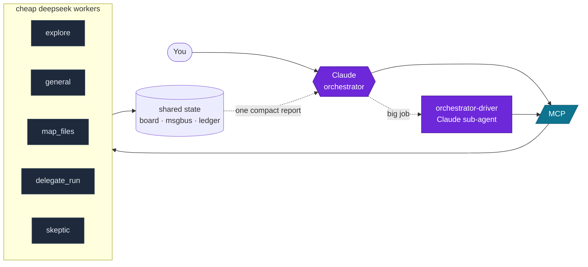

# orchestrator

**An MCP server for the orchestrator → cheap-worker pattern.** Claude (smart,
expensive) plans and validates; a swarm of cheap external models (deepseek via
[opencode zen](https://opencode.ai) / any OpenAI-compatible endpoint) does the
grind — without filling Claude's context with the files they read.



## Why

Cheap models are bad at *driving themselves* but fine at *doing specified work*.
So Claude keeps the judgment and pushes high-volume, fully-specifiable grind down
to workers — paying cheap tokens for the bulk while keeping its own context clean.
Measured: an `explore` scout sweeping 8 modules returned a **19× compressed**
answer (300 tokens reaching Claude vs 5,900 to read them directly), at **$0** on
the free tier.

## Tools

| Group | Tools |
|---|---|
| **Stateless** | `ask_model`, `ask_model_batch` — one-shot text orders |
| **Bulk** | `delegate_run` (validated DAG), `map_files` (one instruction across a glob) |
| **Sub-agents** | `run_agent`, `spawn_agent` (background), `agent_result`, `agent_send` (resume), `agent_stop` |
| **Multi-agent** | `direct` (parallel, deps), `supervise` (+ live watcher model) |
| **Map (free, zero-LLM)** | `understand_project`, `project_context`, `project_overview`, `summarize_project` |
| **Coordination** | `board_read/write`, `send_message`, `read_messages`, `agents`, `monitor`, `events`, `tool_log` |
| **Ops** | `list_models`, `get_spend`, `cache_stats`, `coord_reset` |

**Agent presets** (`agent_type`): `general` · `explore` (read-only scout) ·
`plan` · `skeptic` (adversarial verifier). Pass `output_schema` to force a typed
JSON result; `max_total_tokens` for a runaway backstop.

## Quick start

```bash
python3 -m venv .venv
.venv/bin/pip install -r requirements.txt
cp .env.example .env          # add OPENROUTER_API_KEY (or DELEGATE_API_KEY)
.venv/bin/python -m pytest tests/ -q
```

Register in `~/.claude.json` (or any MCP client):

```json
{ "mcpServers": { "orchestrator": {
  "type": "stdio",
  "command": "/abs/path/orchestrator_mcp/.venv/bin/python",
  "args": ["/abs/path/orchestrator_mcp/server.py"],
  "env": { "OPENROUTER_API_KEY": "sk-...", "ASK_MODEL_DEFAULT": "deepseek-v4-flash-free" }
}}}
```

## How it stays cheap & safe

- **Validators are the cost lever.** Every `delegate_run`/`map_files` unit runs
  *worker → apply → validate → retry → rollback-on-fail*. A pass lets Claude trust
  the result blind (`nonempty` / `regex` / `json` / `shell`).
- **Context protection.** Workers read files into *their* context; only the
  compact report comes back. Full transcripts persist to `.delegate/agents/` so a
  finished agent can be resumed (`agent_send`) with its context intact.
- **Result cache.** Deterministic calls are content-addressed — identical re-runs
  are instant and $0.
- **Safety rails.** Paths confined to `work_dir`; shell off unless `allow_commands`
  is passed (token-boundary match, chaining rejected, denylist regardless).
  Best-effort, not a security boundary — keep allowlists tight.

## Driving the workers well

The worker is a strong reasoner but a **weak loop-driver** — it over-explores and
forgets to converge. Three rules (the presets enforce them):

1. **Scope the reads** — name the files. 2. **Demand convergence** — call `done`
the moment it's answerable. 3. **Force the shape** — pass `output_schema`.

See [`docs/deepseek-behavior.md`](docs/deepseek-behavior.md) for the full
behavioral profile and measurements.

## Layout

`server.py` (MCP surface) · `workers.py` (client + reliability) · `delegate.py`
(DAG loop) · `mapfiles.py` (bulk) · `agent.py` + `subagents.py` + `presets.py`
(tool-calling agents) · `director.py` (multi-agent) · `coordination.py` /
`messages.py` / `store.py` (shared state) · `ledger.py` · `cache.py` ·
`validators.py` / `sandbox.py` (gates) · `project.py` (map).

MIT.
